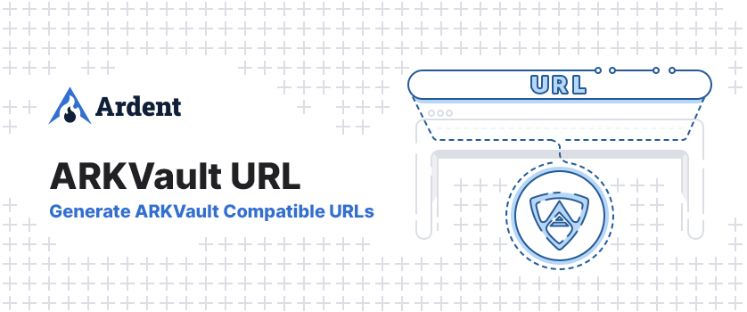

# ARKVault URL

<p align="center">
    
</p>

> A package to generate URLs compatible with ARKVault

## Usage

Install the package in your project

```bash
pnpm install @ardenthq/arkvault-url
```

Import the builder from the package

```js
import { URLBuilder } from "@ardenthq/arkvault-url";
```

Initiate the builder and generate your URL

```js
const builder = new URLBuilder();
const url = builder.generateTransfer("recipient");

> https://app.arkvault.io/#/?method=transfer&recipient=recipient&coin=ARK&nethash=6e84d08bd299ed97c212c886c98a57e36545c8f5d645ca7eeae63a8bd62d8988
```

For further customizations, you can use the following methods

```js
builder.setCoin("Custom"); // Defaults to "ARK"
builder.setNethash("0123..ef)"; // Defaults to ARK's mainnet nethash

new URLBuilder("https://your-url.com"); // Defaults to app.arkvault.io
```

> More detailed docs will follow soon

## Development

[pnpm](https://pnpm.js.org/en/) is required to be installed before starting. It is used to manage this repo.

### Apply `eslint` rules to source

```bash
pnpm run lint
```

### Apply `eslint` rules to tests

```bash
pnpm run lint:test
```

### Apply `prettier` formatting

```bash
pnpm run prettier
```

### Run tests

```bash
pnpm run test
```

## Security

If you discover a security vulnerability within this package, please send an e-mail to security@ardenthq.com. All security vulnerabilities will be promptly addressed.

## Credits

This project exists thanks to all the people who [contribute](../../contributors).

## License

[MIT](LICENSE) © [Ardent](https://ardenthq.com)
